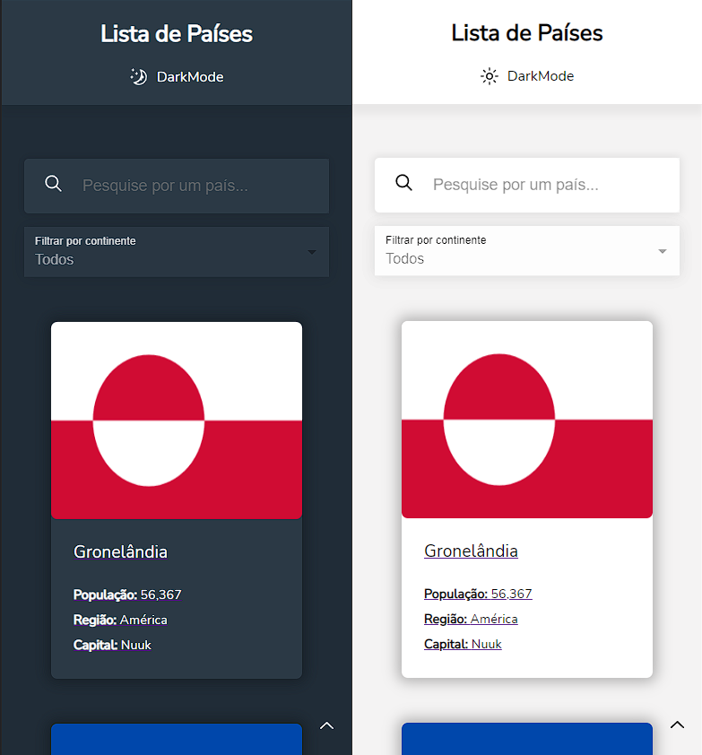

# Bandeiras

Esse projeto é baseado num desafio que encontrei na plataforma do [Frontend Mentor](https://www.frontendmentor.io/), que consiste em um aplicação que exibe e filtra informações sobre todos os países do mundo.

A aplicação é feita em React JS. Nela, para o CSS foi utilizado a biblioteca Styled Components, que facilitou a alteração entre Dark e Light Mode. 

A aplicação utiliza a [Rest Countries API](https://restcountries.com) para a busca dos dados. E para o consumo desta, foi utilizada a biblioteca Axios.

## Temas

  - Dark Mode

  - Light Mode

## Versão Mobile

